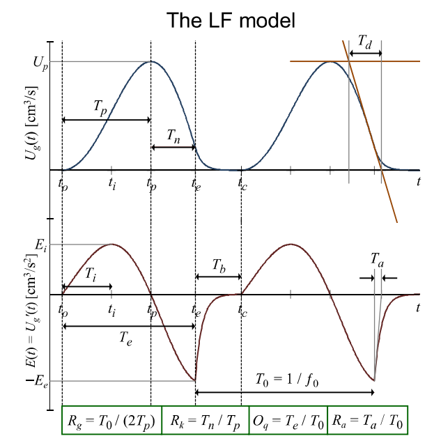

# Python implementation of Liljencrants-Fant (LF) model of the glottal flow

The implementation uses [(Gobl 2017)](<https://pdfs.semanticscholar.org/1418/a18b9c353de44b0c087419d08abae4d0e733.pdf>). Also from that paper is this diagram:

**NOTE:** The LF-model has two implicit equations that need to be solved due to the continuity constraint for $U_g(t)$ and the constraint that the integral over $U_g'(t)$ must be zero. **It seems that the numerical routines are very sensitive to the five LF-model parameters listed below.** When debugging, set `visual=True` to help in the process.

## LF model parameters

The five time-domain parameters (denoted collectively by $P$) describing the GFM derivative are (`@Doval2006 p. 5`):

  1. $E_e$: maximum amplitude of the excitation (i.e. $U_g'(t)$)
  2. $T_0$
  3. $T_e$: instant of maximum excitation (GCI)
  4. $T_p$: instant of the maximum of $U_g(t)$
  5. $T_a$: time constant of the return phase (see picture above)
 
## Alternative parameters
 
Alternative definitions for the last three parameters are (Fant1995, The LF model revisited):

  - $R_k = (T_e-T_p)/T_p$
  - $R_g = T_0/(2T_p)$
  - $F_a=1/(2πT_a)$ (as an alternative to $R_a=T_a/T_0$)
  
This conversion is implemented in the `conv_R_param()` function in `LF.py`.
  
### Typical values

Typical values for male **vowels** are $F_a$ = 700 Hz, $R_k$ = 0.30, $R_g$ = 1.20.

Typical values for female **vowels** are $F_a$ = 400 Hz, $R_k$ = 0.30, $R_g$ = 1.00.

These are implemented in `gen_param()` in `LF.py`.

## Files

`LF.py` implements the model and helper routines.

The two notebooks show use cases. Good luck!
